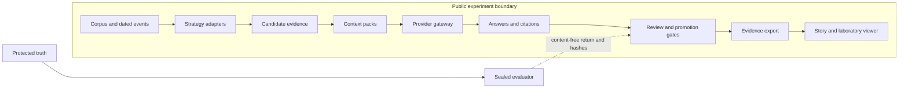
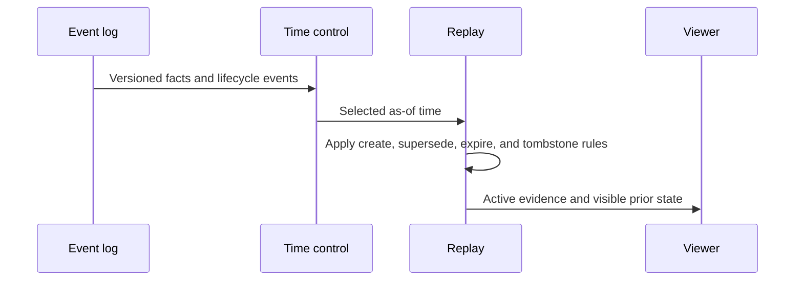

# ContextLab architecture

ContextLab separates system inputs, strategy behavior, generation, evaluation, and publication. The
separation is deliberate. A strategy can see public task and corpus data. It cannot see the truth
used to grade itself.

The sealed evaluator is outside the public boundary. Protected questions, expected answers, gold
evidence, and private grades stay with that evaluator. The system under test receives none of them.

## Public data path

### Corpus and events

NovaLearn is a synthetic enterprise corpus. Public records declare source identity, authority,
status, and time. Event records make changes explicit. A later record can supersede an older record
without deleting history.

### Strategy adapters

Every strategy uses one contract. An adapter receives the frozen task, allowed corpus snapshot,
evidence budget, and strategy configuration. It returns observable candidates and a context pack.
The adapter boundary rejects protected paths, parent traversal, and symlink escape.

### Candidate evidence and context packs

Retrieval and context construction are separate stages. The trace keeps initial candidates, saved
scores, filters, expansion, selection, token allocation, and exclusions. This prevents final answer
quality from hiding a retrieval failure.

A context pack is the exact evidence sent to generation. It has source identities, section
references, ordering, token counts, and a content commitment. A memory policy must show which memory
records entered the pack and which raw evidence supports them.

### Provider gateway

The gateway records the requested and resolved model route, reasoning effort, usage, returned cost,
latency, request identity, retry count, and failure. A provider error remains a failure. The system
does not silently switch routes.

### Answers and citations

The generated answer stays linked to its prompt envelope, context pack, provider receipt, and raw
public sources. Citation presence alone is not enough. The trace can show whether the cited source
was retrieved, selected, and active during generation.

### Review and promotion gates

Technical checks first bind the frozen inputs, result, limitations, and claim wording. Independent
AI reviewers then inspect a byte-bound public workspace. Kevin reviews the evidence and is the sole
human authority. The implementation agent, review agent, and proposal agent cannot approve their
own work.

A gate can pass an execution stage and still retain the simple baseline. Promotion needs all
preregistered conditions, not one positive metric.

### Evidence export and viewer

The public exporter uses an allowlist. It copies only approved public projections and binds each
file to a release manifest. The viewer reads local static data. It makes no model call and has no
fallback sample data in production.

The guided Story explains the decisions. Explore the lab opens the detailed analytical viewer. A
metric remains expandable to its artifact path, exact JSON pointer, source-run identity, and
SHA-256.

The large legacy G2 viewer projection is not part of the curated public release. Its rewritten bytes
do not preserve the embedded semantic commitment. The release uses a compact projection that keeps
lineage to the approved G2 artifact and proves its own bytes in the public manifest.

## One complete evidence trace

The viewer presents a saved run in this order:

1. The task identifies the public question, time boundary, strategy, and frozen controls.
2. Candidate retrieval records every initial candidate and saved score.
3. Context construction records filters, ordering, exclusions, and token allocation.
4. The context pack binds the exact active evidence sent to generation.
5. The provider receipt binds the request, result, usage, cost, latency, and failure state.
6. The answer links each citation to the public source section that supports it.
7. Review records show what each bounded reviewer inspected and the findings returned.
8. The final gate records whether the technique was promoted, rejected, or retained only as
   descriptive evidence.

This path lets a reader distinguish a search failure, selection failure, context overflow,
generation failure, citation failure, and gate failure.

## Temporal state

The time control does not rewrite history. It changes the active view over an append-only event
sequence.

The viewer must show the prior claim, the event that changed it, the active claim at the selected
time, and the source lineage for both states. Motion is limited to the state transition and is
disabled when the user requests reduced motion.

## Sealed evaluation boundary

The sealed evaluator can return task and candidate commitments, permitted grades and failure labels,
aggregate metadata, and an external source-return commitment. A strict importer rejects unknown
fields. It cannot return raw sealed questions, expected answers, gold source IDs, scoring notes, or
private reviewer content.

This one-way boundary keeps evaluation truth out of retrieval, prompts, memory, traces, and the
viewer.

## Gate sequence

- G0 freezes and verifies the v1 baseline.
- G1 establishes shared contracts, the task skeleton, the sealed boundary, and provider accounting.
- G2 tests retrieval components and generation, then decides whether a retriever can be promoted.
- G3 tests temporal memory and lifecycle behavior, then decides whether a memory policy can be
  promoted.
- G4 binds one exact historical evidence viewer snapshot.
- Frontier experiments run only after their own entry and result gates.

The historical G4 approval does not cover later viewer edits. Those edits make the current program
barrier fail closed against the old asset binding. The portfolio Story is a separate release layer
with separate verification and release approval. It is not a new G4 approval.

## Evidence links

- [Experiment charter](../CONTEXTLAB_V2_EXPERIMENT_CHARTER.md)
- [Approved G2 gate](../../results/v2/gates/G2.json)
- [Approved G3 gate](../../results/v2/gates/G3.json)
- [Historical G4 gate](../../results/v2/gates/G4.json)
- [F3 and F5 result memo](../../results/v2/frontier/F3_F5_DEMONSTRATION_SUMMARY.md)
- [Viewer contract](../../viewer/README.md)
- [Public claim ledger](CLAIMS.md)
